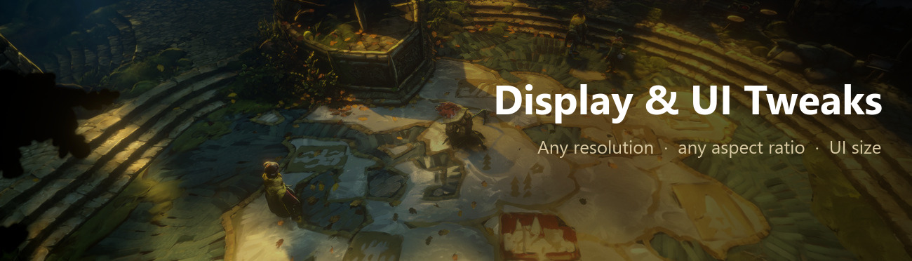

# Display & UI Tweaks

A [MelonLoader](https://github.com/LavaGang/MelonLoader) mod for **No Rest for the Wicked** that makes the game work on
any screen shape (every resolution selectable, no 16:9 letterbox, the whole UI kept in a UI area of any aspect), adds
HUD and menu size settings, a drag-and-drop HUD layout editor with a resizable chat window, and an option to hide the
HUD outside combat. Display only; the game simulation and the save are untouched.

Download: [Nexus Mods](https://www.nexusmods.com/norestforthewicked/mods/102) · [GitHub releases](https://github.com/vergir/NRftW-DisplayUiTweaks/releases/latest)

What players see is described on the Nexus page ([docs/nexus-description.bbcode](docs/nexus-description.bbcode));
how each part works, the game behaviour it depends on and the pitfalls found on the way are in
[docs/internal.md](docs/internal.md).

## Build

* `dotnet build -c Release` builds and copies `DisplayUiTweaks.dll` to `<game>/Mods` (`-p:DeployToGame=false` to skip,
  `-p:GameDir=...` for another install). With HotReload in `<game>/Plugins` the running game picks up new builds.
* `pwsh ./package.ps1` builds the release zip into `dist/DisplayUiTweaks.zip` (`Mods/DisplayUiTweaks.dll`, README,
  LICENSE, CHANGELOG).
* Needs a .NET SDK (6 or newer) and MelonLoader 0.7.3's generated interop assemblies in the game folder (start the game
  once with MelonLoader).
* `docs/pics/make_nexus_images.ps1` builds the Nexus / README images in `docs/pics/nexus` from the raw screenshots in
  `docs/pics` (git-ignored); needs ImageMagick 7.

## Layout

| Path | What |
|---|---|
| `src/DisplayUiTweaksMod.cs`, `src/Prefs.cs` | Entry point, re-apply on scene load / resolution change, unload; `[DisplayUiTweaks]` preferences. |
| `src/UiBox.cs`, `src/UiScaling.cs`, `src/UiToolkitBoxing.cs` | The UI box (`UIAspectConstraint` replacement), canvas scale overrides, UI Toolkit screens. |
| `src/RenderPipelineTweaks.cs` | Letterbox off. |
| `src/SettingsRows.cs` | The rows at the end of Options > Display (Mod Settings Tab moves them to its Mods tab). |
| `src/Hud/HudWidgets.cs`, `HudLayout.cs`, `HudBoxing.cs` | The 16 HUD elements, the saved layout applied every frame, edge-pinned elements put into a UI box. |
| `src/Hud/HudEditor.cs`, `HudSamples.cs`, `MenuHud.cs`, `ChatRows.cs` | Edit HUD Layout: picking, dragging, the chat bracket, sample content, the main-menu HUD copy, extra chat rows. |
| `src/Hud/SettingsPreview.cs`, `HideOutsideCombat.cs` | Previews over the settings menu; Hide HUD Outside Combat. |
| `src/Patches/` | Harmony patches (resolution list and UI Aspect Mode, `UIAspectConstraint`, canvas scaler, settings sliders, UI Toolkit documents). |
| `src/DevCommands.cs` | Development commands, only with `UserData/DisplayUiTweaks/.dev` (list in internal.md). |

## Preferences

`UserData/MelonPreferences.cfg`, section `[DisplayUiTweaks]`:

| Key | Default | |
|---|---|---|
| `Enabled` | `true` | Master switch. |
| `UiArea` | `1.78` | UI Area (1.00-4.00); also a slider in Options. |
| `HudScalePercent` | `100` | HUD & Dialogue UI Size (10-150); also in Options. |
| `MenuScalePercent` | `100` | Menu UI Size (10-150); also in Options. |
| `HideHudOutsideCombat` | `0` | 0 off, 1 on, 2 on but keep health while hurt; also in Options. |
| `HideHudDelay` | `5` | Seconds after combat before the HUD fades out. |
| `HudLayout` | empty | The editor's layout: `Id=x,y,scale[,w,h];` with x, y in parts of the UI box, w, h the chat size factors. |
| `UnlockResolutions` | `true` | List every resolution the display supports. |
| `DisableLetterbox` | `true` | Let the world fill non-16:9 screens. |
| `BoxHudWidgets` | `true` | Keep edge-pinned HUD elements (bounties, item pickups, hint, boss bar, plague meter, area banner) in the UI box. |
| `BoxUiToolkitScreens` | `true` | Keep the bounty / challenge boards and the map's detail bar in the UI box. |
| `FitMenusToBox`, `FitPanelsToBox` | `true` | Scale menus and UI Toolkit panels down to fit the UI box. |
| `StretchMismatchedRoots` | `true` | Box non-screen-sized screen roots by their overlap with the UI box. |
| `HudMaxDpi` | `96` | Canvases with `fallbackScreenDPI` up to this are HUD, above it menus. |
| `AddSettingsRows` | `true` | Add the rows to Options. |
| `AlwaysShowGameUiAspectOption` | `false` | Debug: always show the game's own UI Aspect Mode with all modes. |

Hidden: `UiBoxAspect` and `UiAreaMigrated` (the 1.0.0 Custom ratio, carried over to `UiArea` once).

## License

MIT, see [LICENSE](LICENSE).
