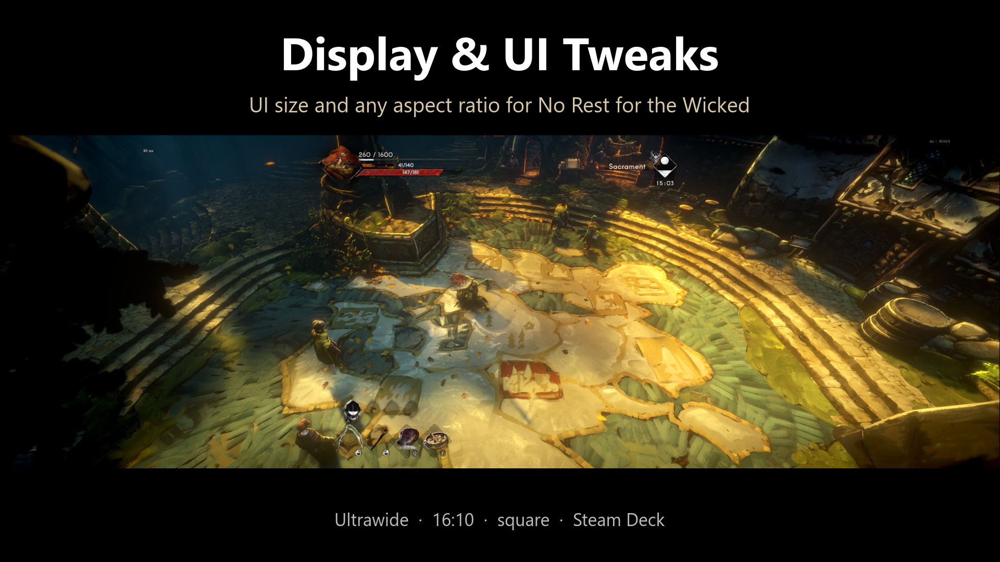
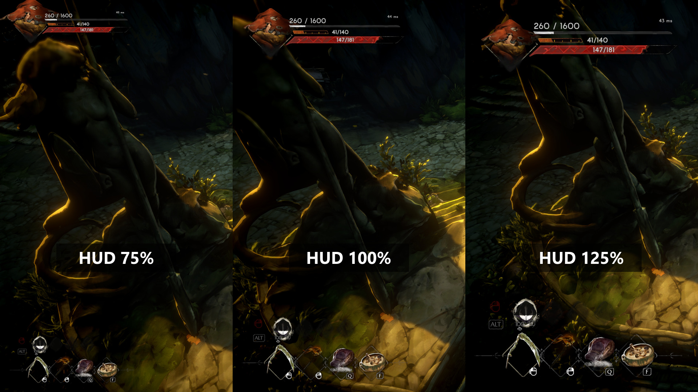
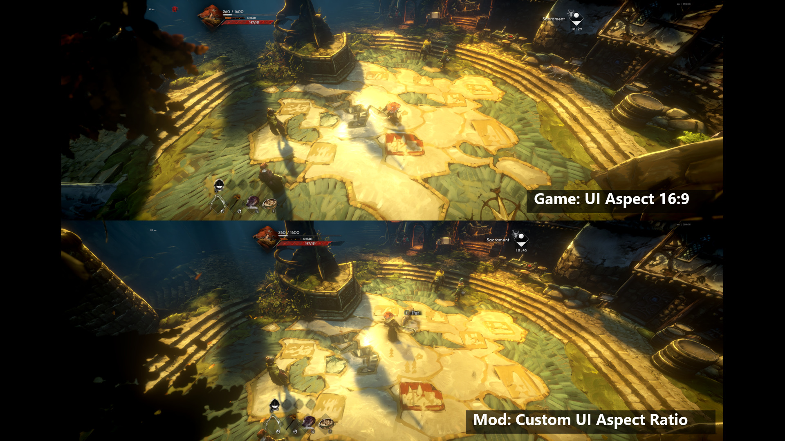
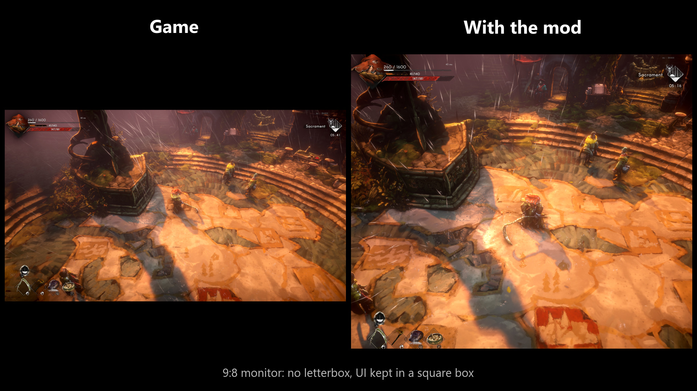

# Display & UI Tweaks



A [MelonLoader](https://github.com/LavaGang/MelonLoader) mod for **No Rest for the Wicked** that makes the game work on
any screen shape: ultrawide, 16:10, square, tall, and the Steam Deck. It adds UI size and UI aspect settings to the
game's own Options menu.

## Features

Out of the box:

* Every resolution your display supports can be picked in **Options > Display**. The game hides anything narrower than
  16:10 or wider than 32:9, and replaces such a saved resolution with a different one at every launch.
* The **UI Aspect Mode** option is always shown (the game hides it on non-widescreen monitors), with all modes plus a
  new **Custom (Display & UI Tweaks)** mode.
* No black 16:9 bars around the world on non-16:9 screens.
* Menus shrink to fit the UI box instead of being cut off.
* The bounty and challenge boards and the map's detail bar stay inside the UI box as well. The game's UI Aspect option
  only boxes parts of these screens. The map itself stays full-screen.

New rows at the bottom of **Options > Display**:

| Row | Range | Default | What it does |
|---|---|---|---|
| HUD & Dialogue UI Size | 10-150% | 100% | In-game HUD, overlays and dialogue. |
| Menu UI Size | 10-150% | 100% | Inventory, stats, map, settings and the other menus. |
| Custom UI Aspect Ratio | 1.00-4.00 | 1.78 | Width-to-height ratio the whole UI is kept in when UI Aspect Mode is "Custom (Display & UI Tweaks)". 1.00 = square, 1.78 = 16:9, 2.33 = 21:9. |
| Bounty Board & Map Fix | On / Off | On | Keeps the bounty and challenge boards and the map's detail bar inside the UI box like the other menus. Turn off to see them as the game draws them. |

With the defaults on a 16:9 monitor the game looks exactly as before; the mod only adds options.

### Examples

* **Ultrawide:** set UI Aspect Mode to 16:9 (or Custom with any ratio) to keep the HUD and menus in the middle of the screen.
* **Square or tall monitor:** pick your resolution, set UI Aspect Mode to Custom and Custom UI Aspect Ratio to 1.00, then
  adjust HUD & Dialogue UI Size to taste.
* **Steam Deck:** works as is; use the size sliders if the text is too small.

## Screenshots

HUD size, 75% / 100% / 125%:



Ultrawide: the game's 16:9 UI box and a custom one:



A 9:8 monitor without and with the mod:



More: [settings](docs/pics/nexus/settings.jpg), [custom ratios](docs/pics/nexus/ultrawide_custom_ratios.jpg),
[menu](docs/pics/nexus/ultrawide_menu.jpg), [stats](docs/pics/nexus/ultrawide_stats.jpg).

## Install

1. Install [MelonLoader](https://github.com/LavaGang/MelonLoader/releases) **0.7.3** or newer into the game
   (`...\steamapps\common\NoRestForTheWicked`) and start the game once.
2. Put `DisplayUiTweaks.dll` into the game's `Mods` folder (the [release zip](https://github.com/Vergir/NRftW-DisplayUiTweaks/releases/latest) already has that layout: extract it into
   the game folder).

### Steam Deck / Linux (Proton)

1. Install MelonLoader into the game folder the same way (copy the files from `MelonLoader.x64.zip`, the Windows build,
   into `~/.local/share/Steam/steamapps/common/NoRestForTheWicked`), and the mod into `Mods`.
2. In Steam, open the game's **Properties > General > Launch Options** and enter:
   ```
   WINEDLLOVERRIDES="version=n,b" %command%
   ```
3. Start the game. On the first start MelonLoader downloads and installs the .NET runtime it needs into the Proton
   prefix by itself, and generates its assemblies; that first start takes a minute or two.

## Settings file

Everything is also stored in `<game>/UserData/MelonPreferences.cfg`, section `[DisplayUiTweaks]`. Besides the four
rows above it has switches for each feature (`UnlockResolutions`, `UnlockUiAspectModes`, `DisableLetterbox`,
`FitMenusToBox`, `FitPanelsToBox`, `StretchMismatchedRoots`, `AddSettingsRows`) and a master `Enabled` switch.

## Compatibility

* Tested with game build 29466 and MelonLoader 0.7.3 on Windows and on a Steam Deck.
* Display only: nothing in the game simulation or your save is changed, so it does not affect co-op.
* Game updates can move things around. If the mod stops working after an update, check the MelonLoader log
  (`<game>/MelonLoader/Latest.log`) and open an issue.

## Build

Requires a .NET SDK (6 or newer) and MelonLoader installed in the game (so `MelonLoader/Il2CppAssemblies` exists).

```
dotnet build -c Release
```

The DLL is copied to `<game>/Mods` after every build (`-p:DeployToGame=false` to skip, `-p:GameDir=...` if the game is
installed elsewhere). `pwsh ./package.ps1` builds the release zip into `dist/`.

## How it works

See [docs/internal.md](docs/internal.md).

## License

[MIT](LICENSE)
